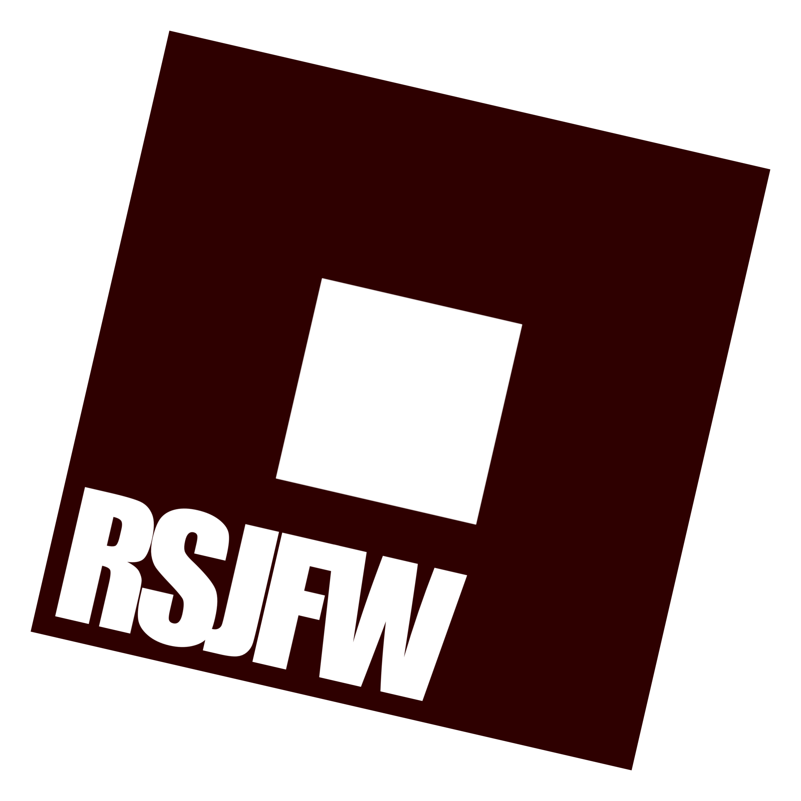

# RSJFW



&nbsp;

**Roblox Studio Just Fully Works.** 

no configuration errors, no launching then crashing, no dependency issues, no env var setting

it JUST fully works.

<br clear="left"/>

### Installation

**Arch Linux (AUR)**
```bash
yay -S rsjfw
# or
yay -S rsjfw-git
```

**Manual Install (Dev)**
```bash
mkdir build && cd build
cmake ..
make -j$(nproc)
./rsjfw install
```

We do not provide binaries outside of our AUR package. Feel free to package it yourself however!

### Usage
- `rsjfw launch` Launch or install studio
- `rsjfw config` Open the config editor
- `rsjfw kill` Kill any running Roblox Studio instances
- `rsjfw help` Show help
